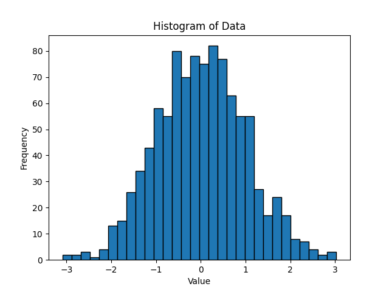
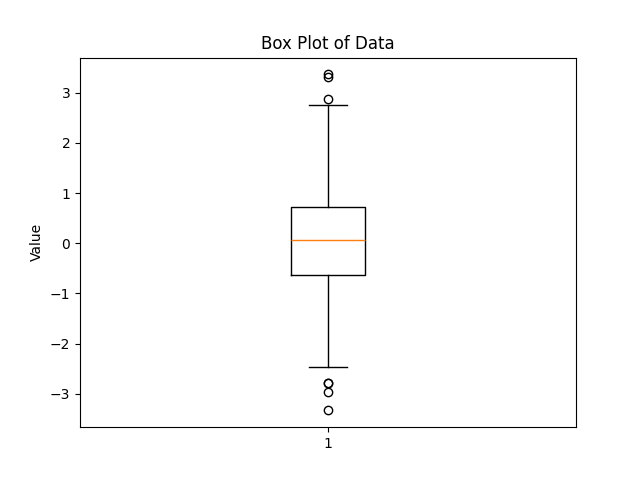

[Home](../bootcamp-main.md)

> “Geometry is knowledge of the eternally existent.”
> — Pythagoras

# Lesson 5: Exploratory Data Analysis (EDA) - Descriptive Statistics and Visualization

Exploratory Data Analysis (EDA) is a crucial step in the data science process, where we summarize the main characteristics of a dataset often using visual methods. EDA helps in understanding the data, detecting anomalies, finding patterns, and forming hypotheses. We will focus on descriptive statistics and basic visualizations to explore a dataset.

- **Descriptive statistics:** mean, median, mode, variance, standard deviation
- **Data distribution**: histograms, box plots
- **Relationships between variables:** scatter plots, correlation matrices

## Descriptive Statistics: Mean, Median, Mode, Variance, Standard Deviation

**Descriptive statistics** summarize and describe the essential features of a dataset. They provide simple summaries about the sample and the measures, giving insight into the distribution, central tendency, and variability of the data.

### Mean

The **mean** (average) is the sum of all values in the dataset divided by the number of values. It represents the central tendency of the data.

```math
\text{Mean} = \frac{\sum_{i=1}^{n} x_i}{n}
```

Where $`x_i`$ represents the values and $`n`$ is the number of observations.

```python
import numpy as np

data = [10, 20, 30, 40, 50]
mean = np.mean(data)
print(mean)  # Output: 30.0
```

### Median

The **median** is the middle value when the data is sorted. It is a better measure of central tendency than the mean when the data is skewed or contains outliers.

```python
median = np.median(data)
print(median)  # Output: 30.0
```

### Mode

The **mode** is the most frequent value in the dataset. For categorical data, the mode is the most common category.

```python
from scipy import stats

mode = stats.mode(data)
print(mode.mode[0])  # Output: 10 (if 10 occurs most frequently)
```

### Variance

**Variance** measures how far the values in the dataset are spread from the mean. It is the average of the squared differences from the mean.

```math
\text{Variance} = \frac{\sum_{i=1}^{n} (x_i - \mu)^2}{n}
```

Where $`\mu`$ is the mean of the dataset.

```python
variance = np.var(data)
print(variance)  # Output: Variance of the data
```

### Standard Deviation

The **standard deviation** is the square root of the variance. It provides insight into the dispersion of the data and is expressed in the same units as the data.

```math
\text{Standard Deviation} = \sqrt{\text{Variance}}
```

```python
std_dev = np.std(data)
print(std_dev)  # Output: Standard deviation of the data
```

## Data Distribution

### Histograms

A **histogram** is a graphical representation of the distribution of numerical data. It shows the frequency of data points within specific intervals (bins), helping to visualize the distribution's shape (e.g., skewness, modality).

Example of plotting a histogram in Python using **Matplotlib**:

```python
import matplotlib.pyplot as plt

# Generate sample data
data = np.random.normal(0, 1, 1000)

# Plot a histogram
plt.hist(data, bins=30, edgecolor='black')
plt.title('Histogram of Data')
plt.xlabel('Value')
plt.ylabel('Frequency')
plt.show()
```



**Fig 1.** Histogram of normally distributed data values.

### Box Plots

A **box plot** (or **box-and-whisker plot**) visualizes the distribution of data by showing the median, quartiles, and outliers. It helps identify skewness, spread, and potential outliers in the data.

Key components:

- **Median**: The line inside the box.
- **Interquartile Range (IQR)**: The range between the 1st quartile (Q1) and 3rd quartile (Q3).
- **Whiskers**: Represent the range of data that is not considered outliers.
- **Outliers**: Data points that fall outside the whiskers.

Example in Python using **Matplotlib**:

```python
import matplotlib.pyplot as plt
import numpy as np

# Generate sample data
data = np.random.normal(0, 1, 1000)

plt.boxplot(data)
plt.title("Box Plot of Data")
plt.ylabel("Value")
plt.show()
```



**Fig 2.** Box plot of normally distributed data values.

## Relationships Between Variables

### Scatter Plots

A **scatter plot** visualizes the relationship between two numerical variables by plotting data points on a 2D plane. Each point represents an observation, with one variable on the x-axis and the other on the y-axis.

Scatter plots are helpful for detecting:

- **Linear relationships** (positive or negative correlation),
- **Clusters** of data points,
- **Outliers**.

Example of a scatter plot in Python:

```python
# Generate sample data
x = np.random.rand(100)
y = 2 * x + np.random.randn(100) * 0.1

# Plot a scatter plot
plt.scatter(x, y)
plt.title('Scatter Plot of X vs Y')
plt.xlabel('X')
plt.ylabel('Y')
plt.show()
```

### Correlation Matrices

A **correlation matrix** displays the pairwise correlation coefficients between multiple variables. The correlation coefficient ranges from -1 to 1:

- **+1** indicates a perfect positive correlation,
- **-1** indicates a perfect negative correlation,
- **0** indicates no correlation.

The **Pearson correlation coefficient** is commonly used to measure the linear relationship between two variables.

Example of calculating and visualizing a correlation matrix in Python using **Pandas** and **Seaborn**:

```python
import matplotlib.pyplot as plt
import numpy as np
import pandas as pd
import seaborn as sns

# Create a sample DataFrame
data = {"X1": np.random.rand(100), "X2": np.random.rand(100), "X3": np.random.rand(100)}
df = pd.DataFrame(data)

# Calculate the correlation matrix
corr_matrix = df.corr()

# Visualize the correlation matrix as a heatmap
sns.heatmap(corr_matrix, annot=True, cmap="coolwarm")
plt.title("Correlation Matrix")
plt.show()
```


**Fig 3.** Correlation matrix of the variables X1, X2, and X3.

## Problem

**Problem Statement:** You are given a dataset containing information about different cars, including their make, model, year, engine size, horsepower, and mileage.

**Your tasks are:**

1. Calculate the descriptive statistics for the numeric columns.
2. Visualize the distribution of engine size and horsepower using histograms.
3. Create a box plot to show the distribution of mileage.
4. Create a scatter plot to explore the relationship between engine size and horsepower.
5. Calculate and visualize the correlation matrix for the numeric columns.

**Dataset:**

```csv
Make, Model, Year, EngineSize, Horsepower, Mileage
Toyota, Corolla, 2010, 1.8, 132, 30
Honda, Civic, 2012, 2.0, 158, 32
Ford, Focus, 2015, 2.0, 160, 28
Chevrolet, Malibu, 2018, 1.5, 160, 29
Nissan, Sentra, 2013, 1.8, 130, 31
```

## Explanation

1. **Create DataFrame:** We start by creating a DataFrame from the given dataset.
2. **Descriptive Statistics:** We use the `describe()` method to get a summary of the descriptive statistics for the numeric columns.
3. **Histograms:** We create histograms for the 'EngineSize' and 'Horsepower' columns to visualize their distributions.
4. **Box Plot:** We create a box plot for the 'Mileage' column to show its distribution and identify any potential outliers.
5. **Scatter Plot:** We create a scatter plot to explore the relationship between 'EngineSize' and 'Horsepower'.
6. **Correlation Matrix:** We calculate the correlation matrix for the numeric columns and visualize it using a heatmap to understand the relationships between different variables.

## Solution

```python
import pandas as pd
import matplotlib.pyplot as plt
import seaborn as sns

# Step 1: Create a DataFrame from the dataset
data = {
    "Make": ["Toyota", "Honda", "Ford", "Chevrolet", "Nissan"],
    "Model": ["Corolla", "Civic", "Focus", "Malibu", "Sentra"],
    "Year": [2010, 2012, 2015, 2018, 2013],
    "EngineSize": [1.8, 2.0, 2.0, 1.5, 1.8],
    "Horsepower": [132, 158, 160, 160, 130],
    "Mileage": [30, 32, 28, 29, 31]
}
df = pd.DataFrame(data)

# Step 2: Calculate the descriptive statistics for the numeric columns
descriptive_stats = df.describe()

# Step 3: Visualize the distribution of engine size and horsepower using histograms
plt.figure(figsize=(12, 5))

plt.subplot(1, 2, 1)
sns.histplot(df["EngineSize"], bins=5, kde=True)
plt.title("Engine Size Distribution")

plt.subplot(1, 2, 2)
sns.histplot(df["Horsepower"], bins=5, kde=True)
plt.title("Horsepower Distribution")

plt.tight_layout()
plt.show()

# Step 4: Create a box plot to show the distribution of mileage
plt.figure(figsize=(6, 5))
sns.boxplot(y=df["Mileage"])
plt.title("Mileage Distribution")
plt.show()

# Step 5: Create a scatter plot to explore the relationship between engine size and horsepower
plt.figure(figsize=(6, 5))
sns.scatterplot(x="EngineSize", y="Horsepower", data=df)
plt.title("Engine Size vs Horsepower")
plt.show()

# Step 6: Calculate and visualize the correlation matrix for the numeric columns
correlation_matrix = df.corr()
plt.figure(figsize=(8, 6))
sns.heatmap(correlation_matrix, annot=True, cmap="coolwarm", fmt=".2f")
plt.title("Correlation Matrix")
plt.show()

# Results
print("Descriptive Statistics:")
print(descriptive_stats)
```

---

[Data Cleaning and Preprocessing ←](../bootcamp-subpages/lesson-04.md) | [Home](../bootcamp-main.md) | [→ Numpy and Pandas](../bootcamp-subpages/lesson-06.md)

---
